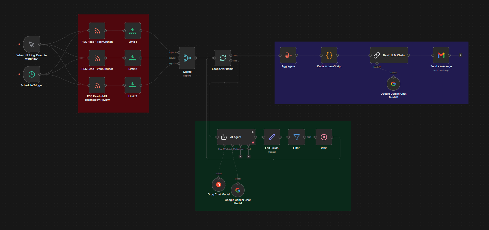
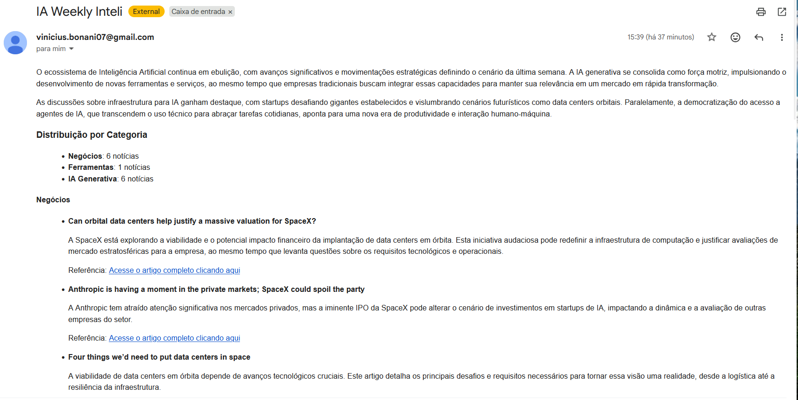

# IA Weekly Inteli: Curadoria Inteligente com n8n

## Descrição do Projeto

Este projeto automatiza a criação de uma newsletter semanal sobre Inteligência Artificial para a comunidade da Inteli Academy. O workflow consome feeds RSS de grandes portais (TechCrunch, VentureBeat, MIT Tech Review), filtra conteúdos relevantes via IA, e gera um relatório consolidado em HTML enviado diretamente por e-mail.

## Workflow

## Resultado Final

## Tecnologias e Ferramentas

    n8n: Orquestração de fluxos e integração de serviços.

    Groq (Llama 3.3 70b & 3.1 8b): Modelos de linguagem de alta velocidade para classificação e redação.

    Google Gemini (2.5 Flash-Lite): Camada de resiliência e fallback para garantir a continuidade do serviço.

    JavaScript (Node.js): Processamento e normalização de dados brutos das LLMs.

    Gmail API: Canal de entrega final da newsletter.

## Diferenciais Técnicos e Arquitetura

1. Resiliência Multi-LLM (Fallback)

O sistema foi projetado com uma arquitetura de redundância. Caso a API da Groq atinja limites de taxa (Rate Limits) ou apresente instabilidade, o workflow chaveia automaticamente para o Google Gemini, garantindo que o relatório seja gerado sem interrupções.

2. Throttling e Estabilidade de Fluxo

Para lidar com as restrições de RPM (Requisições por Minuto) das APIs em regime gratuito, foi implementada uma estratégia de Batching de 5 elementos combinada com um nó de Wait (15 segundos). Isso garante que o sistema opere dentro dos limites de cota sem comprometer a integridade dos dados.

3. Normalização de Dados via Code Node

Utilizei um nó de código JavaScript para tratar as saídas das IAs, aplicando métodos de String Sanitization (.trim()) para evitar duplicidade na contagem de categorias e garantir um relatório visualmente limpo.

## Como Utilizar

Importe o arquivo PS-Inteli-Academy.json no seu n8n.

Configure as credenciais para:

    Groq Cloud (API Key).

    Google Gemini (API Key via AI Studio).

    Gmail (OAuth2 ou App Password).

Execute o workflow manualmente ou aguarde o Schedule Trigger semanal.

## Evoluções Futuras

Expansão de Canais de Entrega: Integração com APIs pagas,como do WhatsApp, para envio da newsletter em um meio mais difundido e prático.

Modelos de Raciocínio Avançado: Utilização de modelos como o o1-preview ou GPT-4o para análises de mercado ainda mais profundas e precisas, reduzindo ruídos de conteúdos tangenciais.